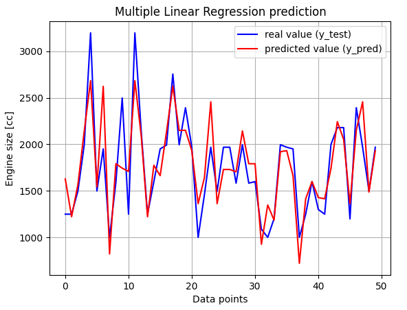

#Multiple Linear Regression Example

In this Multiple Linear Regression Example,
 we consider whether it is possible to predict the car engine size
 (in [cc]), from its Length, Seating Capacity and Fuel Tank Capacity.

The answer is YES! :) The current example clearly shows this by
 using the Multiple Linear Regression Machine Learning model.

To do this exercise, I have used a vehicle dataset from Kaggle. (Here is the address of this dataset: https://www.kaggle.com/datasets/nehalbirla/vehicle-dataset-from-cardekho)

These datasets have different categories. In this exercise, I have chosen to explore whether it is possible to find the vehicle’s engine size, by using only some of its technical parameters.

The Machine Learning model is implemented in Python.

The following figure shows the Multiple Linear Regression prediction
in this case.

